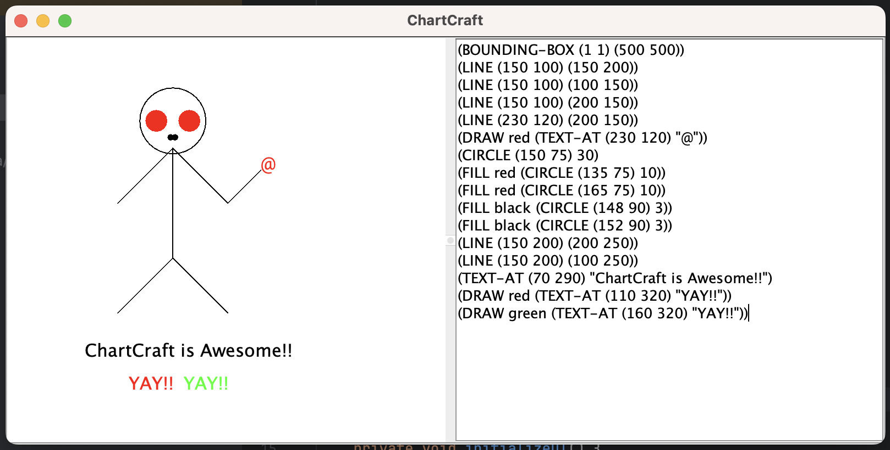

# ChartCraft
ChartCraft is a Java and Scala-based Integrated Development Environment (IDE) designed for creating graphical representations such as charts with embedded text. Developed as part of the Software Correctness course at Aarhus University, this application provides a platform for users to input graphical commands and view their output dynamically on a Euclidean plane.



## Features
**Euclidean Graphics Viewer:** Features a viewer that displays graphical objects with a background grid.

**Graphics Language Editor:** An editor that allows users to input and modify graphical commands which directly influence the viewer without intermediate processing.

**Dynamic Drawing with Bounding Box:** Implements a bounding box within which all drawings are clipped, enhancing the control over visible graphics.

**Support for Multiple Shapes and Colors:** Users can draw lines, rectangles, circles, and embed text, with support for multiple colors and fill options.

**Real-time Highlighting:** Highlights the currently drawn object, providing immediate visual feedback. ( in progress )

## Prerequisites
To run ChartCraft, you must have the following installed:

* Java JDK 11 or higher
* Scala SDK 2.13 or higher
* Simple Build Tool (SBT) for compiling Scala code

## Installation
To get started with ChartCraft, clone the repository and compile the source code:
```bash
git clone https://github.com/arman-bd/chartcraft.git
cd chartcraft
sbt compile
```

## Running the Application
To launch the ChartCraft IDE, execute the following command:

```bash
sbt run
```

The application window should open, divided into a graphical viewer on the left and a graphics command editor on the right.

## Command Syntax Table

| Command        | Description                                           | Syntax                                                   | Example                                   |
|----------------|-------------------------------------------------------|----------------------------------------------------------|-------------------------------------------|
| `BOUNDING-BOX` | Defines a bounding box within which to draw.           | `(BOUNDING-BOX (x1 y1) (x2 y2))`                         | `(BOUNDING-BOX (0 0) (300 300))`          |
| `LINE`         | Draws a line between two points.                       | `(LINE (x1 y1) (x2 y2))`                                 | `(LINE (100 100) (200 200))`              |
| `RECTANGLE`    | Draws a rectangle given two opposite corners.          | `(RECTANGLE (x1 y1) (x2 y2))`                            | `(RECTANGLE (50 50) (150 150))`           |
| `CIRCLE`       | Draws a circle given a center point and radius.        | `(CIRCLE (x y) r)`                                       | `(CIRCLE (120 120) 60)`                   |
| `TEXT-AT`      | Places text at a specified position.                   | `(TEXT-AT (x y) "text")`                                 | `(TEXT-AT (160 160) "Hello, world!")`     |
| `DRAW`         | Applies a color to enclosed commands.                  | `(DRAW color g1 g2 ...)`, where `g1`, `g2`, ... are commands | `(DRAW red (LINE (10 10) (200 200)))`   |
| `FILL`         | Fills a drawable object with color.                    | `(FILL color g)`, where `g` is a drawable command        | `(FILL blue (CIRCLE (100 100) 50))`       |

### Additional Notes

- **Coordinates and Measurements**: All coordinates and dimensions are in pixels.
- **Colors**: Supported color values include `black`, `red`, `green`, `blue`, `yellow`. Custom colors need to be defined in the color map within the Scala code.
- **Order of Operations**: All drawing commands must respect the bounding box if defined. Commands are executed in the order they are provided.
- **Nested Commands**: `DRAW` and `FILL` commands can contain other drawing commands.

This table provides a clear guide to the syntax required by ChartCraft for creating and manipulating graphical elements on the canvas. Users should refer to this table to ensure their commands are correctly formatted to achieve the desired graphical output.

Example:
```text
(BOUNDING-BOX (1 1) (500 500))
(LINE (150 100) (150 200))
(LINE (150 100) (100 150))
(LINE (150 100) (200 150))
(LINE (230 120) (200 150))
(DRAW red (TEXT-AT (230 120) "@"))
(CIRCLE (150 75) 30)
(FILL red (CIRCLE (135 75) 10))
(FILL red (CIRCLE (165 75) 10))
(FILL black (CIRCLE (148 90) 3))
(FILL black (CIRCLE (152 90) 3))
(LINE (150 200) (200 250))
(LINE (150 200) (100 250))
(TEXT-AT (70 290) "ChartCraft is Awesome!!")
(DRAW red (TEXT-AT (110 320) "YAY!!"))
(DRAW green (TEXT-AT (160 320) "YAY!!"))
```

## TODO
* Need to work on coordinate and size as per project guideline
* Need to apply testing strategies for both Java and Scala part of the project.

## Contributing
Contributions are welcome. Please fork the repository, create a feature branch, and submit a pull request for review.

## Testing
**TBD**

## Documentation
**TBD**

## Authors
[Arman](https://github.com/arman-bd) and Team

## License
This project is licensed under the MIT License.

## Acknowledgments
[Aarhus University](https://au.dk) - For providing the academic environment and guidance necessary for this project.